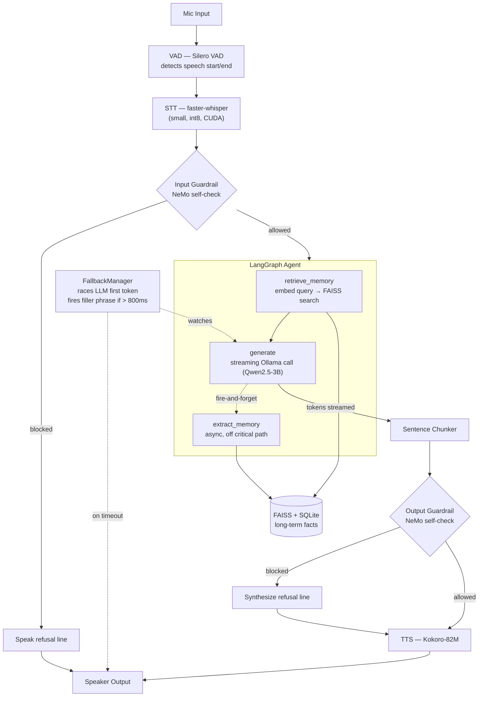

# Architecture

## Pipeline Flow

Generation and speech are **overlapped, not sequential** — a bounded producer/consumer queue (`pipeline.sentence_queue_maxsize`) lets sentence 2 keep generating while sentence 1 is still being guardrail-checked, synthesized, and played. See the "Full Pipeline" section below for why an earlier, simpler sequential version of this was a real bug, not just a simplification.

## Component Breakdown

### VAD (Voice Activity Detection)
- Tech: Silero VAD
- Role: Detects speech start/end in real-time mic stream
- Output: audio chunk when user finishes speaking
- Latency: ~0.2-0.3ms per 512-sample window, warm (Part 9 numeric benchmark — `scripts/benchmark.py --component vad`) — negligible against budget, confirms the Part 1 estimate.

### STT (Speech-to-Text)
- Tech: faster-whisper (small, int8, CUDA)
- Role: Transcribes audio chunk to text
- Latency target: < 400ms — measured 68ms median / 81ms P95 on RTX 4060 Laptop (see `latency_report.md`)

### LangGraph Agent
- Tech: LangGraph + Ollama (qwen2.5:3b)
- Nodes: `START → retrieve_memory → generate → extract_memory → END` — fully wired as of Part 3.
- Role: Core reasoning layer with memory access
- Streaming: `generate_node` uses LangGraph's `get_stream_writer()` to emit raw tokens via `stream_mode="custom"` as they arrive from Ollama, rather than collecting the full response first — this is what lets the sentence chunker (Part 4) start TTS mid-generation.
- Measured: 587ms warm first-token latency, ~36s cold (see `latency_report.md`) — confirms Ollama pre-warm is required at pipeline startup (Part 7).
- `extract_memory` is sequenced last in the graph but is fire-and-forget internally (`asyncio.create_task`) — the node returns near-instantly and the actual classify+store work runs in the background, so it doesn't add to turn latency. Facts from the current turn aren't retrievable until the next turn.

### Memory System
- Short-term: `memory/short_term.py`'s `ShortTermMemory` — rolling deque of last 10 turns (in-memory), owned by the pipeline (Part 7), not the graph. `AgentState["messages"]` is a snapshot passed in/out each turn.
- Long-term: `memory/long_term.py`'s `LongTermMemory` — FAISS (`IndexIDMap` over `IndexFlatIP`, cosine similarity) + SQLite (fact text), persisted to `data/memory/`. Same integer id used in both, kept in sync on every write. Includes near-duplicate detection (cosine ≥ 0.92 skips re-storing).
- Embeddings: `memory/embeddings.py`'s `Embedder` — all-MiniLM-L6-v2, normalized vectors, loaded once.
- Fact extraction: a second, separate Ollama call (not the conversational one) classifies whether a user utterance contains a durable fact and rewrites it in third person, or returns `NONE`. Deliberately classifies on the user's text only, not the assistant's reply — see `agent/prompts.py` for why. See `tradeoffs.md` for the full retrieval/extraction design writeup and known limitations.

### Guardrails
- Tech: NeMo Guardrails, `guardrails/manager.py`'s `GuardrailsManager` — `check_input(text)` / `check_output(text)`, both `async`, each returning a `GuardrailResult(allowed, message)`.
- Scope: input + output self-check rails only (no dialogue rails — latency budget). Config: `guardrails/config.yml` (main model = qwen2.5:3b via Ollama, `self_check_input`/`self_check_output` few-shot prompts) + `guardrails/rails/input_rails.co` / `output_rails.co` (Colang flow definitions, kept as the canonical human-readable spec — see below for why they aren't what actually runs).
- **How a check runs**: `GuardrailsManager` calls NeMo's built-in `self_check_input`/`self_check_output` actions directly via `LLMRails.runtime.action_dispatcher.execute_action(...)`, bypassing `rails.generate()` and the Colang flow engine entirely. This was a deliberate choice, not a simplification for its own sake: `rails.generate()` drives NeMo's own dialog loop, and with nothing to stop it, an allowed input falls through to NeMo generating its *own* full response with the main model — redundant, since `agent/nodes.py`'s `generate_node` already owns real response generation with memory-aware context. Direct action dispatch gets exactly one focused LLM call per check and nothing else. See `docs/tradeoffs.md` for the debugging path that led here (an `options={"rails": {...}}`-restricted `generate()` call was tried first and silently no-op'd on output checks).
- **Fail-open on error**: if the self-check action itself fails (Ollama down, exception, etc.), `check_input`/`check_output` return `allowed=True` rather than blocking — a broken safety check shouldn't make the assistant go silent. Consistent with this project's "no abrupt silences" UX requirement; the tradeoff is a check that's down fails permissively rather than restrictively. Config toggles (`guardrails.enabled`, `check_input`, `check_output` in `config.yaml`) can disable checks entirely, in which case no LLM call is made at all and the manager just returns `allowed=True` immediately.
- Wired into the pipeline at the pipeline level as of Part 7, per the plan ("guardrails wired at pipeline level, not inside LangGraph graph") — `pipeline/pipeline.py`'s `ConversationPipeline.run_turn()` calls `check_input()` on the STT transcript before generation, and `_speak_guarded()` calls `check_output()` on each sentence before it's spoken. See `docs/latency_report.md` for the real measured cost once wired in (non-trivial — full-pipeline latency exceeds the 2s budget, largely due to guardrail-check inflation under GPU contention with the other resident models, not the checks themselves being slow in isolation).
- `max_tokens: 3` / `stop: ["\n"]` were added to both self-check prompts in Part 7 after a real bug: without them, qwen2.5:3b occasionally answered with a full explanatory paragraph instead of a bare "Yes"/"No" (still classified correctly, just generated 100+ extra tokens doing it) — one measured case took 5069ms instead of ~300ms. See `docs/tradeoffs.md`.
- **Part 9 optimization**: `_speak_guarded()` now runs `check_output()` and `tts.synthesize()` *concurrently* (`asyncio.gather`) instead of sequentially — the check is the slower of the two, so overlapping hides most of synthesis's cost behind it. On the rare sentence that gets blocked, the pre-synthesized audio is discarded and the refusal line is synthesized separately; on the common allowed path, this is a pure latency win with no safety-coverage tradeoff. Measured ~260-400ms saved per turn — see `docs/latency_report.md`'s Part 9 section.

### TTS (Text-to-Speech)
- Tech: Kokoro-82M via `audio/tts.py`'s `KokoroTTS` — 24kHz output, independent of the 16kHz mic/STT rate (`AudioManager.play_audio()`/`open_speaker()` open the output stream at whatever rate the TTS engine reports, reopening only if the rate changes). Piper (fallback) is config-selectable (`create_tts_engine()`) but not implemented — `piper-tts` isn't installed and wasn't needed once Kokoro's CUDA issue was fixed; raises `NotImplementedError` if selected.
- `SentenceChunker`: regex-based (`[.!?]\s`) boundary detection on the raw token stream. Requires punctuation *followed by whitespace*, which avoids false-splitting decimals ("3.14") but does split mid-sentence abbreviations ("Dr. Smith") — an accepted simplification, not full NLP sentence segmentation. See `tradeoffs.md`.
- `SentenceStreamPlayer`: the overlap orchestrator — a producer coroutine feeds tokens into the chunker and queues completed sentences; a consumer coroutine pulls off that queue and does synthesis + playback (each wrapped in `asyncio.to_thread` since both Kokoro inference and PyAudio writes are blocking calls). The two run concurrently via `asyncio.gather`, so sentence 2 can be synthesizing while sentence 1 is still playing.
- Measured (CUDA torch): ~100-170ms per average sentence. On CPU-only torch this was 1200-1500ms/sentence — see `latency_report.md`'s CUDA runtime gap note for why, and the fix.

### Latency Monitor
- `pipeline/latency_monitor.py`'s `LatencyMonitor` — per-turn stage timer. `start_turn()` resets, `mark(stage)` records elapsed ms since `start_turn()` at each checkpoint (called in the order stages actually happen — `stt`, `llm_first_token`, `tts_first_chunk`, etc.), `log_summary()` derives each stage's individual duration from the gap between consecutive marks and logs a breakdown like `[stt: 68ms | llm_first_token: 587ms | total: 655ms]`, gated on `config.yaml`'s `logging.log_latency`.
- Deliberately mark()-based rather than a context-manager-per-stage: every stage the plan lists (VAD end, STT end, LLM first token, TTS first chunk, TTS complete) is a point-in-time event in an inherently sequential pipeline, where one stage's end is the next stage's start — a single ordered dict of checkpoints is enough to reconstruct every stage's duration, so a second API wasn't needed.
- Wired into every real turn as of Part 7 — `ConversationPipeline.run_turn()` calls `start_turn()`/`mark()` at each real checkpoint and `log_summary()` at turn end. Reused for both the fallback threshold check and the Part 9 benchmark report, per the plan.

### Fallback Manager
- `pipeline/fallback.py`'s `FallbackManager` — `watch(first_token_event: asyncio.Event) -> bool`, run concurrently with the real streaming generation call (`asyncio.gather(fallback.watch(event), generate(...))`, with `generate` setting the event on its first token). Races `asyncio.wait_for(event.wait(), timeout=...)` against `fallback.llm_first_token_timeout_ms` (800ms default). If the event wins, `watch()` returns `False` and does nothing. If the timeout wins, `watch()` picks a random phrase from `fallback.filler_phrases`, synthesizes it with the real `KokoroTTS` engine, plays it through the real `AudioManager`, and returns `True`.
- Fires filler phrases if LLM first-token latency > 800ms. Proactive, not reactive — fires on delay, not on error; the assistant should sound like it's still "with you" during a slow response rather than going silent or announcing a failure.
- Directly depends on the real `audio.tts.KokoroTTS` + `audio.audio_manager.AudioManager` (not a generic callback abstraction) since both were already built and tested in Part 4 — consistent with how `SentenceStreamPlayer` uses them directly.
- Wired into the real generation call as of Part 7 — `ConversationPipeline._generate_and_speak()` starts `fallback.watch()` right after the input guardrail check passes (not before, and not at turn start), so it races only the LLM's own first-token latency. This was a specific, deliberate fix for a collision Part 6 flagged: starting the timer any earlier would let the input guardrail's own ~328-600ms count against the 800ms budget, making the fallback fire on nearly every guarded turn. Measured directly in Part 7's full-pipeline test: the gap between the guardrail check completing and `fallback.watch()` starting was 0.1ms, confirming the fix.

### Full Pipeline (Part 7)
- `pipeline/pipeline.py`'s `ConversationPipeline` — owns every component above plus `ShortTermMemory`, and orchestrates one full turn in `run_turn()`: blocking VAD-listen loop (`asyncio.to_thread`) → STT → input guardrail (refusal spoken directly and turn ends early if blocked) → `_generate_and_speak()` (fallback race + LangGraph streaming + output-guardrail-gated sentence-by-sentence TTS) → short-term memory update → `LatencyMonitor.log_summary()`.
- `_stream_and_speak()` uses the same producer/consumer overlap pattern as `SentenceStreamPlayer` (`asyncio.Queue` + `asyncio.gather(produce(), consume())`), with the output guardrail check added inside the consumer — `SentenceStreamPlayer` itself isn't reused since it has no guardrail hook (see `docs/tradeoffs.md` for why an earlier, simpler sequential-loop version of this method was a real bug: it accidentally lost the overlap, since a plain `async for` loop pauses the token producer while awaiting each sentence's guardrail-check+synthesis+playback).
- The queue is **bounded** (`config.yaml`'s `pipeline.sentence_queue_maxsize`, default 3) — real backpressure: once full, the producer's `queue.put()` blocks until the consumer (guardrail check + synthesis + real-time playback — the slow side) frees a slot, so LLM generation can't race arbitrarily far ahead of how quickly sentences can actually be spoken. Rarely engages given this project's normal 1-3 sentence responses; added specifically as a small, safe, functionally-real producer-consumer/bounded-buffer demonstration. Proven with a real timing test against the actual unmodified method, not asserted — see `docs/tradeoffs.md` decision 38 for a real measurement subtlety found while writing that test (a blocked `put()` on the *last* item is invisible to naive instrumentation, since there's no subsequent token request for the delay to show up in).
- `_speak_raw()`/`_speak_guarded()` fire an `on_synthesized` callback right after TTS synthesis completes and *before* the blocking `play_audio()` call — this is where `tts_first_chunk` is actually marked, since `play_audio()` blocks for the sentence's full real-time playback duration; marking after it returns would measure "finished speaking," not "started speaking" (a real bug caught and fixed during Part 7's own latency testing).
- Turn-level exceptions are caught and logged in `run_forever()`'s loop rather than crashing the session, per CLAUDE.md's "no abrupt silences" requirement — one bad turn shouldn't end the conversation.
- `main.py` — loads `config.yaml`, configures logging, builds `ConversationPipeline`, calls `prewarm()`, then `run_forever()`.
- Verified end-to-end with real components (no mocks): real Kokoro-synthesized speech round-tripped through the real VAD/STT/guardrails/LLM/TTS, including a genuinely adversarial input correctly blocked and a multi-sentence response correctly split and each sentence individually checked. See `docs/latency_report.md` for the full numbers — full-pipeline latency currently exceeds the 2s budget by ~600-800ms even with the GPU otherwise idle, due to resource contention across this project's own five concurrently-resident models, not a code defect in any one component.

### Web Demo (Part 8, stretch goal)
- `audio/audio_io.py` — a small `AudioIO` `Protocol` (`open_mic`, `read_chunk`, `play_audio`, `close`) that `audio.audio_manager.AudioManager` already satisfies structurally. `ConversationPipeline.__init__` gained one optional parameter, `audio_manager: AudioIO | None = None` (defaults to a real `AudioManager` — `main.py`'s CLI path is unaffected), so the exact same tested Part 7 turn logic (`run_turn`, `_generate_and_speak`, `_stream_and_speak`'s producer/consumer overlap, guardrail gating, fallback race) is reused unchanged for the web path rather than duplicated. `pipeline/fallback.py`'s `FallbackManager` type hint was updated to `AudioIO` for accuracy (no behavior change — it already just calls `.play_audio()` on whatever it's given).
- `demo/web/ws_handler.py`'s `WebSocketAudioIO` is the second `AudioIO` implementation: `read_chunk()` blocks on a thread-safe `queue.Queue` fed by an async receive loop (needed because `read_chunk()` runs on a worker thread via `asyncio.to_thread`, called from `_listen_for_utterance`); `play_audio()` bridges back onto the event loop via `asyncio.run_coroutine_threadsafe(...).result()`, blocking the calling thread until the browser-bound send completes, matching `AudioManager.play_audio`'s blocking semantics. A disconnect pushes a sentinel value so `read_chunk()` raises `WebSocketSessionEnded` instead of blocking a thread-pool thread forever — `_listen_for_utterance`'s `while True: read_chunk()` loop has no other way to learn the browser is gone.
- One `ConversationPipeline` is built once at server startup (`demo/web/app.py`'s `lifespan`, `prewarm()` called once) and reused across browser sessions rather than rebuilt per connection — re-loading Whisper/Kokoro/Silero/guardrails/the LangGraph agent on every reconnect would cost ~15-30s per click. `SileroVAD.reset()` and `ShortTermMemory.clear()` (both already existed, already documented for exactly this purpose) are called at the start of each new session. Only one session is allowed at a time (`app.state.session_active`, config's `web.max_concurrent_sessions`) — a single-user demo, not a multi-tenant service.
- WebSocket protocol (`WS /ws`): one JSON `session_start` frame from the browser (carries its real `AudioContext.sampleRate`, since it can't reliably be forced to 16000Hz from JS), then continuous binary Float32 PCM frames at that native rate; server resamples to 16kHz with `scipy.signal.resample_poly` (rational/polyphase resampling, exact ratio via `math.gcd`) before feeding `SileroVAD`. Server → browser: JSON `status` (`listening`/`speaking`) and `latency` (per-stage breakdown, via `LatencyMonitor.stage_durations()` — a small additive method, same refactor that also backs `log_summary()`'s existing formatted output) and `error` frames, plus binary Float32 PCM at Kokoro's fixed 24kHz, one frame per spoken sentence.
- No server-side hook exists for a "processing" (thinking) status between "listening" and "speaking" without adding instrumentation to tested Part 7 code — `app.js` infers it client-side instead (a short timer armed on "listening"; if "speaking" hasn't arrived within ~500ms, show a processing state locally). Zero additional pipeline.py changes needed for this.
- Frontend (`demo/web/static/`): one button + status line + small latency readout (deliberately minimal — no live transcript/caption panels, chosen over a fuller UI to keep focus on voice interaction rather than reading text). Mic capture via an `AudioWorkletProcessor` (`mic-worklet.js`, off the main thread, unlike the deprecated `ScriptProcessorNode`) batching into ~32ms frames. Playback schedules incoming 24kHz PCM chunks gaplessly via a running `nextPlaybackTime` cursor on a single shared `AudioContext` (also used for capture — Web Audio auto-resamples an `AudioBuffer`'s declared rate to the context's actual output rate, so no client-side resampling code is needed for playback even though capture and playback are technically at different rates).
- **Part 9 visual redesign**: dark navy base with a red/blue duality that maps directly onto conversation state — red for "your turn" (listening), blue for "the assistant's turn" (speaking), violet as the blend between them for "thinking" (processing), amber kept deliberately distinct for errors. A `<canvas>` behind the button renders a real, audio-reactive frequency-bar visualizer via Web Audio's `AnalyserNode` — one analyser tapped off the mic source (drawn while listening) and one tapped off the TTS-playback signal chain (drawn while speaking) — not a decorative fake animation; it's reading real frequency data from whichever signal is live. Idle/processing states fall back to a slow ambient breathing ring, since there's no audio signal to visualize then. `AnalyserNode`s are visualization taps only (`.connect()` doesn't reroute audio by itself), so adding them doesn't cause double-playback or mic self-monitoring.
- Verified end-to-end without a real browser (no browser/mic available in the dev shell): the same real-Kokoro-speech technique from Part 7, upsampled to a simulated browser rate (48kHz) and streamed over a real WebSocket connection to the actual running server, confirming correct resampling, VAD firing, STT, guardrail gating (both a benign and a blocked-with-spoken-refusal turn), TTS playback frames, and status/latency messages — plus separate checks that reconnecting after a session ends resets cleanly and that a second concurrent connection is rejected rather than corrupting shared state.
- Scope explicitly cut for this stretch goal (documented, not accidental): reconnection/resume, real multi-tenant concurrency, auth, HTTPS/WSS (unnecessary — browsers treat `localhost`/`127.0.0.1` as a secure context for `getUserMedia` even over plain HTTP), mobile/responsive layout, and barge-in/interrupt-while-speaking (inherited as-is from Part 7's strictly sequential `run_turn()` — already a documented Future Expansion Point, not a new punt).

### Tests + Benchmarks (Part 9)
- `scripts/benchmark.py` completed: VAD, TTS, and full-pipeline sections added alongside the existing STT one (Part 5's guardrail benchmark was already present). `--component {vad,stt,tts,guardrails,pipeline,all}`.
- `tests/test_latency.py`: fills the gaps not already covered by component-specific latency tests — VAD single-window inference, `retrieve_memory` latency, and LLM first-token latency (the last of these previously only measured by ad hoc scripts, never a permanent pytest assertion).
- `tests/test_pipeline_e2e.py`: formalizes the real-Kokoro-speech round-trip technique used for manual verification throughout Parts 7-8 into permanent tests — a benign turn (correct transcript + correct answer), an adversarial turn (blocked, no LLM call), and a sane latency ceiling check (5s, not a strict 2s assertion — see `docs/tradeoffs.md` for why a hard 2000ms assertion here would be a flaky test, not a meaningful signal, given the documented GPU-contention variance). Required a module-scoped async fixture (`pytest_asyncio.fixture` + `pytest.mark.asyncio(loop_scope="module")`) rather than a plain sync fixture wrapping `asyncio.run()` — the latter binds the pipeline's Ollama client to a throwaway event loop that closes before the tests run, surfacing as `RuntimeError: Event loop is closed` on the second test to touch the pipeline.
- Full suite: **82/82 passing** (76 from Parts 1-8 + 3 new latency tests + 3 new e2e tests), full run takes ~47 minutes (dominated by `test_pipeline_e2e.py`'s real multi-second TTS playback per turn) — see `docs/tradeoffs.md` for why this wasn't trimmed down.

## Design Decisions & Tradeoffs

[See tradeoffs.md]

## Implementation: Part 10
